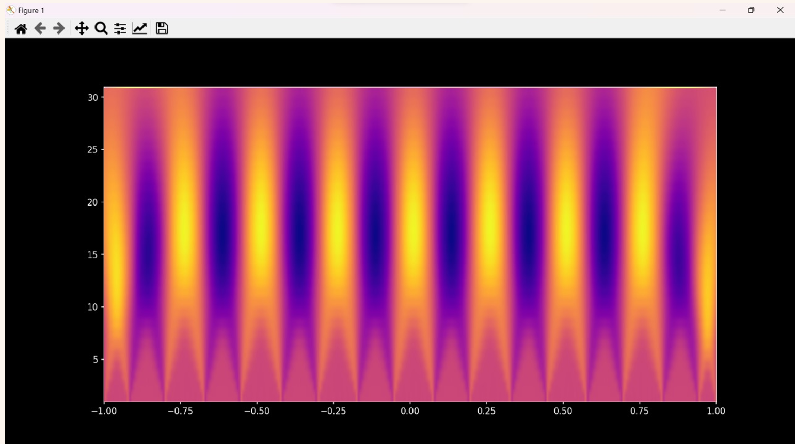

# ESP32 Oscilloscope

## Overview

This ESP32 Oscilloscope project allows you to visualize analog data in real-time using an ESP32 microcontroller and Python. It includes features like a normal waveform view, Fast Fourier Transform (FFT), and wavelet transform. The oscilloscope is controlled through buttons connected to the ESP32.

### Hardware

### Real-Time Visualization

### FFT Visualization

### Wavelet Visualization

## How it Works

1. **ESP32 Setup**: The ESP32 reads analog data from a sensor and controls the oscilloscope modes based on button inputs.
2. **Serial Communication**: The ESP32 sends analog data and button states over serial to the computer.
3. **Python Visualization**: A Python script reads the serial data and uses Matplotlib to visualize the analog waveform. It supports different visualization modes based on button inputs received from the ESP32.

## Features

- **Real-Time Visualization**: Display analog waveform data in real-time.
- **Normal Waveform View**: View the raw analog waveform as it is.
- **Fast Fourier Transform (FFT)**: Analyze frequency components of the waveform.
- **Wavelet Transform**: Visualize both time and frequency information simultaneously.

## Usage

1. **Hardware Setup**:
   - Connect the analog sensor to ADC1_CHANNEL_5 (GPIO 33).
   - Connect two buttons to GPIO12 and GPIO17.

2. **Software Setup**:
   - Upload the `esp32_oscilloscope.ino` code to the ESP32 using the Arduino IDE.
   - Install the required Python libraries (`pyserial`, `numpy`, `scipy`, `matplotlib`).

3. **Running the Program**:
   - Run the Python script `oscilloscope.py`.
   - Ensure the correct COM port is specified in the Python script (`port = 'COMX'`).
   - The oscilloscope will display the analog waveform in real-time.
   - Use the buttons connected to the ESP32 to toggle between different visualization modes.

## Notes
- Adjust the COM port (`port`) in the Python script to match your setup.
- Ensure the ESP32 is properly powered and connected to the computer before running the Python script.
- Experiment with different analog sensors and signal sources to observe various waveforms.
- Be cautious with electrical connections to prevent damage to the ESP32 or connected components.